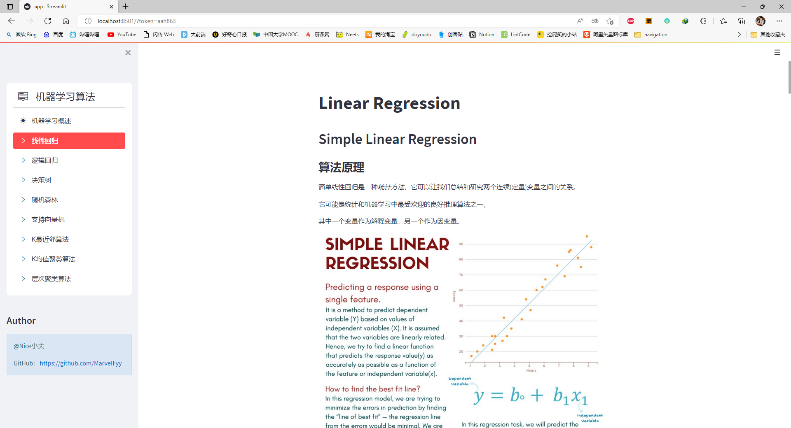
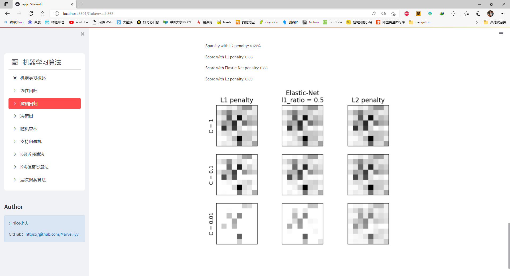

# streamlit-machine-learning
A simple machine learning algorithm web application based on streamlit \
Streamlit, yes!

# install
    pip install -r requirements.txt
<<<<<<< HEAD
# run
    streamlit run app.py
=======

# run
    streamlit run app.py
    
>>>>>>> c175956143d2f10cb60a9162abe0730e199b9140
# awsome screenshot

